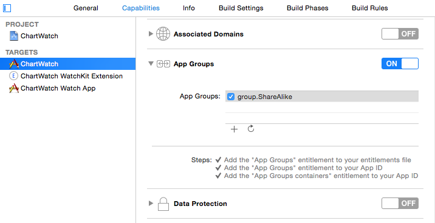

#Displaying a ShinobiChart on WATCH

##How To

The following steps assume that you already have an iPhone app that you'd like to add a WatchKit Extension to, and that app already contains ShinobiCharts. If you don't have ShinobiCharts in your app, [grab a free trial here](http://www.shinobicontrols.com/ios/shinobisuite/price-plans/shinobicontrols-product-bundle/shinobicontrols-free-trial-form).

You can also [download the sample code from this project from GitHub](https://github.com/ShinobiControls/ChartWatch).

###Adding a Watch App to your project

First things first, you'll need to add a Watch App target to your application first. Select 'Add Target' in XCode, and select Apple Watch -> Watch App. The default settings will do for now, so select finish.

###Setting up a Shared App Group

[The WatchKit programming guide](https://developer.apple.com/library/prerelease/ios/documentation/General/Conceptual/WatchKitProgrammingGuide/DesigningaWatchKitApp.html "WatchKit Programming Guide") states that 'If your iOS app and WatchKit extension rely on the same data, use a shared app group to store that data. An app group is an area in the local file system that both the extension and app can access.'

To set this up, select your iPhone app target, then capabilities. Find 'App Groups' in the list, and switch this to 'ON'. Once this is done, select the default option with the checkbox. You'll need to do the exact same thing for your WatchKit Extension target too.

This should have created a couple of entitlements files, one in each target. Verify this and your iPhone app should now be ready to share data with your WatchKit Extension.

###Creating a Chart screenshot

You can't take a snapshot of a ShinobiChart without adding that chart to the view hierarchy first. You can't add subviews to your WatchKit App. You have to define all of the interface elements in a storyboard. This means that the screenshot will have to be taken in the iPhone application, then sent to the WatchKit Extension.

There's an [existing tutorial on how to take a screenshot of a ShinobiChart](http://www.shinobicontrols.com/blog/posts/2012/03/26/taking-a-shinobichart-screenshot-from-your-app) by Stuart already, so I won't cover that here.