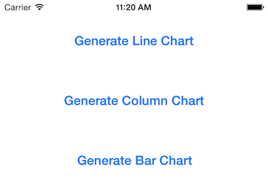

#Displaying a ShinobiChart on WATCH

Apple recently released [WatchKit](https://developer.apple.com/library/prerelease/ios/documentation/General/Conceptual/WatchKitProgrammingGuide/index.html), the eagerly awaited SDK for the new WATCH, meaning developers can now start to work on their own Watch Apps. This blog post explores how to display ShinobiCharts inside of your WatchKit apps.

Unfortunately, the WatchKit SDK seems to be quite heavily restricted at the moment. You can only define and layout views in Storyboards created with interface builder, and there's very little option for modifying these views. You can't add custom views to Watch Apps, which presents quite a challenge for app developers who wish to build engaging, informative apps.

Therefore, for now at least, we are restricted in how we can display a chart in a Watch App. The only option currently seems to render a chart as an image, then display that image on the Watch App. Even this has it's challenges. As you need to add a view to the view hierarchy to take a screenshot of it, you can't generate these screenshots on the watch. You have to generate them inside an iPhone app and transfer them. Further complicating matters is the fact that there's no direct communication between iPhone apps and Watch apps. You have to set up a shared app group and save files to that app group to share data.

There is a way to do this though, and I've outlined the approach that we have settled on (for now) below. We will be continuing to *watch* developments with WatchKit closely, and have already started working on an API to make this easier for users of our Charts Framework.

##How To
###Prerequisites
The following steps assume that you already have an iPhone app that you'd like to add a WatchKit Extension to, and that app already contains ShinobiCharts. If you don't have ShinobiCharts in your app, [grab a free trial here](http://www.shinobicontrols.com/ios/shinobisuite/price-plans/shinobicontrols-product-bundle/shinobicontrols-free-trial-form). You should also thoroughly read through the [WatchKit Programming Guide from Apple.](https://developer.apple.com/library/prerelease/ios/documentation/General/Conceptual/WatchKitProgrammingGuide/index.html)

In order to follow along, you can [download the sample code from this project from GitHub](https://github.com/ShinobiControls/ChartWatch).

###Adding a Watch App to your project

First things first, you'll need to add a Watch App target to your application first. Select 'Add Target' in XCode, and select Apple Watch -> Watch App. The default settings will do for now, so select finish.

###Setting up a Shared App Group

[The WatchKit programming guide](https://developer.apple.com/library/prerelease/ios/documentation/General/Conceptual/WatchKitProgrammingGuide/DesigningaWatchKitApp.html "WatchKit Programming Guide") states that '*If your iOS app and WatchKit extension rely on the same data, use a shared app group to store that data. An app group is an area in the local file system that both the extension and app can access.*'

To set this up, select your iPhone app target, then capabilities. Find 'App Groups' in the list, and switch this to 'ON'. Once this is done, select the default option with the checkbox. You'll need to do the exact same thing for your WatchKit Extension target too.

This should have created a couple of entitlements files, one in each target. Verify this and your iPhone app should now be ready to share data with your WatchKit Extension.

###Creating a Chart screenshot

You can't take a snapshot of a ShinobiChart without adding that chart to the view hierarchy first. You can't add subviews to your WatchKit App. You have to define all of the interface elements in a storyboard. This means that the screenshot will have to be taken in the iPhone application, then sent to the WatchKit Extension.

There's an [existing tutorial on how to take a screenshot of a ShinobiChart](http://www.shinobicontrols.com/blog/posts/2012/03/26/taking-a-shinobichart-screenshot-from-your-app) by Stuart already, so I won't cover that here. In the sample application, the chart screenshots are generated when a button is pressed in the `ViewController` class. These buttons are set up in the storyboard. 

When a user taps one of these buttons, the chart type is set, `prepareForScreenshot` is called, which reloads and redraws the chart, then after a slight delay to let the chart render, `screenshot` is called.

	/**
     *  Prepare for a screenshot to be taken by reloading the data and redrawing the chart.
     */
    - (void)prepareForScreenshot {
        [self.chart reloadData];
        [self.chart redrawChart];
    }

    /**
     *  Take a screenshot of the chart's GLView and save it to the shared application group directory.
     */
    - (void)screenshot {
        // Generate a UIImage from the chart's GLView.
        // (See http://www.shinobicontrols.com/blog/posts/2012/03/26/taking-a-shinobichart-screenshot-from-your-app)
        UIImage *chartImage = [self.chart.canvas.glView snapshot];
        
        // Find the baseURL for the shared app group, and then append chartImageData.png to it to give us the file path.
        NSFileManager *defaultManager = [NSFileManager defaultManager];
        NSURL *baseUrl = [defaultManager containerURLForSecurityApplicationGroupIdentifier:@"group.ShareAlike"];
        NSURL *fileUrl = [baseUrl URLByAppendingPathComponent:@"chartImageData.png" isDirectory:NO];
        
        // Convert the image to PNG file data.
        NSData *fileData = UIImagePNGRepresentation(chartImage);
        
        // Write the file, and display an alert if the file fails to write.
        NSError *writeError;
        if (![fileData writeToURL:fileUrl options:NSDataWritingAtomic error:&writeError]) {
            // Writing to a file failed. Show why.
            UIAlertController *alert;
            alert = [UIAlertController alertControllerWithTitle:@"File write failed"
                                                        message:writeError.debugDescription
                                                 preferredStyle:UIAlertControllerStyleAlert];
            
            [alert addAction:[UIAlertAction actionWithTitle:@"OK"
                                                      style:UIAlertActionStyleDefault
                                                    handler:nil]];
            
            [self presentViewController:alert animated:YES completion:nil];
        }
    }

The code above is from [`ViewController.m`](https://github.com/ShinobiControls/ChartWatch/blob/master/ChartWatch/ChartWatch/ViewController.m), and it will save a screenshot of the chart to the shared app group's file directory. It's worth noting that the user won't see a change in their app, as when the chart is set up, it's frame is set so that it will never be visible.

###Setting up the Watch App to show an image

You now need an image view in your Watch App to display the chart image that has just been generated. Open up the Watch App directory in your XCode project and then select Interface.storyboard. Drag an Image from the Object Library onto the main screen in your storyboard. Set the properties of the image to match those in the image below.

Now create an IBOutlet to link that image view to the InterfaceController.m file created in the WatchKit Extension you created earlier.

###Showing the image on the Watch

All that is left is to show the image in the image view on the watch interface. To do this, it is necessary to read the file from the shared app group. However, it should also listen for changes to the file and update the watch interface if changes do occur. Otherwise the image would never change and only be read on startup. To solve this, make `InterfaceController.m` conform to the `NSFilePresenter` protocol. Then in the `initWithContext:` method, add the following line:

	[NSFileCoordinator addFilePresenter:self];
	
There are two mandatory methods from `NSFilePresenter` that should be implemented. The first of these, `presentedItemURL`, tells the `NSFileCoordinator` which file `InterfaceController` is interested in. The second, `presntedItemOperationQueue` tells the `NSFileCoordinator` which queue `InterfaceController` wants notifications of changes to occur on. 

	- (NSURL *)presentedItemURL {
        return self.chartImageFileURL;
    }

    - (NSOperationQueue *)presentedItemOperationQueue {
        return [NSOperationQueue mainQueue];
    }

    - (void)presentedItemDidChange {
        [self updateImage];
    }

`presentedItemDidChange` should also be implemented, which will update what is displayed.

Finally, the image should also be updated when the view becomes active

	- (void)willActivate {
    	[self updateImage];
	}

In order to update the image, the WatchKit Extension must read from the file. This is done in `updateImage`.

	- (void)updateImage {
        NSError *error;
        if (![self.chartImageFileURL checkResourceIsReachableAndReturnError:&error]) {
            NSLog(@"Chart image not available at %@. Error: %@", self.chartImageFileURL, error.debugDescription);
            return;
        }
        
        UIImage *image = [UIImage imageWithData:[NSData dataWithContentsOfURL:self.chartImageFileURL]];
        [self.imageView setImage:image];
    }

And that's it! The screenshot of the chart should now be displayed on the Watch, and be automatically updated when the user taps one of the buttons on the iPhone screen.